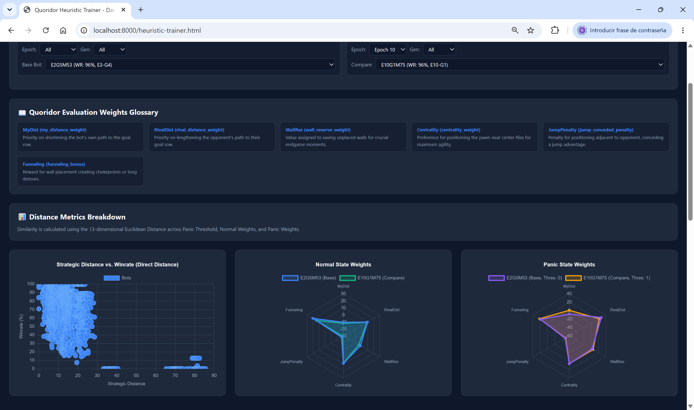
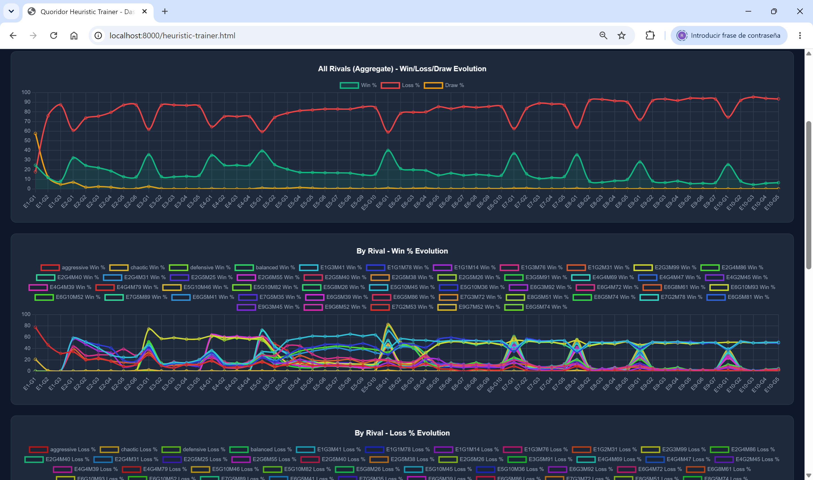
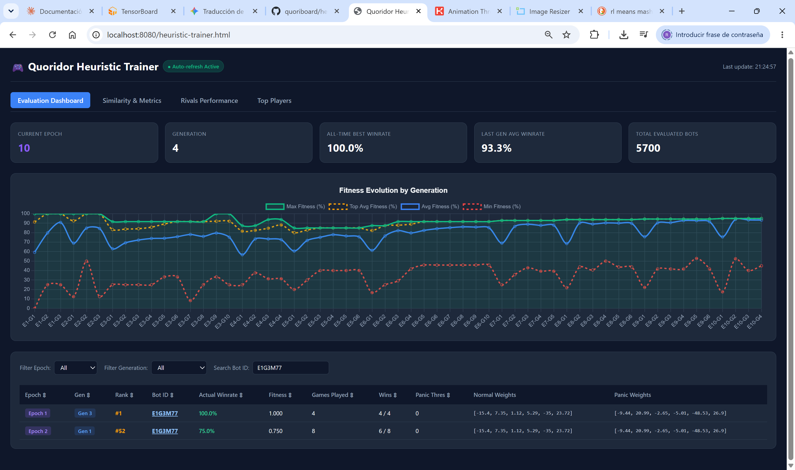
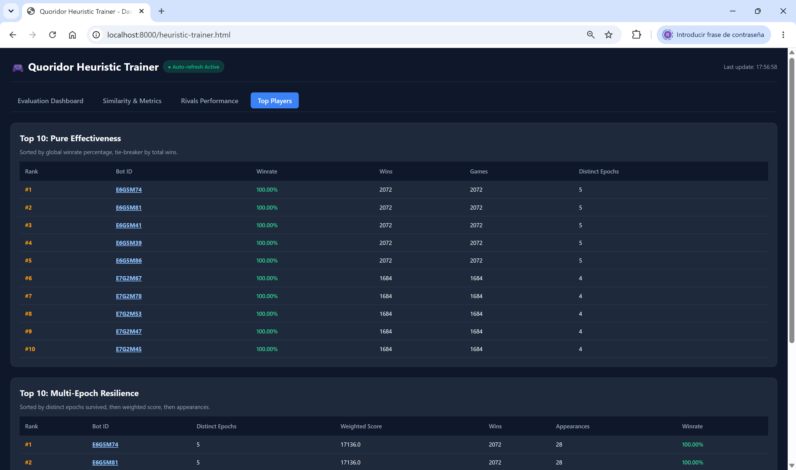

# Heuristic Training Platform

Genetic algorithm training system designed to find good weights for [heuristic bot](./heuristic-bot.md). All behavior is configured via a YAML file; the general mechanism and the specific configuration used for the benchmark trainings are documented below.

## How to Run

```bash
go run ./cmd/heuristic_trainer/ --config <path-to-yaml>
```

Once the command is running, you can access it in your browser at `http://localhost:8080/heuristic-trainer.html`.

Configuration files live in [configs/](/configs/). For example, there is one for training heuristics against heuristics [configs/heuristic_trainer.yaml](/configs/heuristic_trainer.yaml) and another for heuristics against minimax3 [configs/heuristic_vs_minimax3_trainer.yaml](/configs/heuristic_vs_minimax3_trainer.yaml).

## Reference Configuration

```yaml
epochs: 10
generations: 10
population_size: 100
top_keep: 20
benchmark_add_per_epoch: 5
benchmark_max_size: 100
mutation_rate_start: 0.6
mutation_rate_end: 0.08
mutation_amount_start: 4.0
mutation_amount_end: 0.6
max_turns: 120
seed_bots:
  - aggressive
  - defensive
  - balanced
  - chaotic
benchmark_bots:
  - aggressive
  - defensive
  - balanced
  - chaotic
web_listen_addr: ":8080"
dashboard_path: "./web"
data_json_path: "./web/heuristic.json"
```

- `population_size`: Number of candidate bots per generation (mutated population).
- `top_keep`: How many of the best bots are kept to generate the next generation.
- `seed_bots`: Initial bots used to kick off the population (the `aggressive`, `defensive`, `balanced`, and `chaotic` profiles defined in [/internal/adapters/bot/heuristic_weights.go](/internal/adapters/bot/heuristic_weights.go).
- `benchmark_bots`: Rivals against which the population competes in epoch 1.
- `benchmark_add_per_epoch` / `benchmark_max_size`: How many new rivals are added to the pool when moving to a new epoch, and the maximum cap for that pool.
- `max_turns`: Turn limit per match.
- `dashboard_path` / `data_json_path` / `web_listen_addr`: Where the dashboard is served and where results are persisted (a JSON file, with no database required).

## Cycle: Population, Generation, Epoch

### Population and Mutation


Each generation (except the first one) consists of the `top_keep` best bots from the previous generation plus mutations of these bots until `population_size` is reached. Mutation happens **field by field, not as a block**: for each individual weight in `NormalWeights` and `PanicWeights`:

1. A probability `rand.Float64() < mutationRate` is rolled — if it fails, that specific weight does not change in this mutation.
2. If it mutates, a noise `delta = (rand.Float64()*2 - 1) * mutationAmount` is added (meaning a uniform random value between `-mutationAmount` and `+mutationAmount`).
3. The result is clamped to the range `[-50, 50]` and rounded to 2 decimal places.

`PanicThreshold` is mutated separately, with a delta of `±1` and the same `mutationRate`.

Mutation intensity is not constant: it interpolates between an initial value and a final value as training progresses:

```
mutation_rate_start: 0.6   →  mutation_rate_end: 0.08
mutation_amount_start: 4.0 →  mutation_amount_end: 0.6
```

At the beginning, more weights mutate and with greater magnitude (exploration); as epochs advance, fewer weights mutate and with smaller magnitude (exploitation), refining rather than exploring widely.

### Generation

In generation 1 of epoch 1, using the reference configuration, each of the 100 bots plays against each of the 4 rivals in `benchmark_bots`, on both sides of the board (each bot starts once in each starting position). That means: `population_size × number_of_rivals × 2` matches.

**Draws**: if a match reaches `max_turns` without anyone winning, it is considered a draw — it does not count as a win or a loss for either side. Each bot's fitness is calculated as `Wins / GamesPlayed`, so draws dilute the ratio without directly penalizing it like a loss would.

When all matches in a generation are finished, the `top_keep` (20) best bots are selected by win ratio, and the next generation starts with them (plus their mutations).

### Transition from Generation to Epoch

An epoch advances to the next one when any of these conditions occur:

1. **Success**: The top 20 of a generation reach a 100% win rate.
2. **Degradation**: If the average fitness (`avgFit`) worsens for 2 consecutive generations, the epoch is cut short and automatically skips to the next one. This was empirically verified: when specimens begin to stagnate playing against the same rivals, continuing to push against that same pool tends to degrade them rather than improve them.
3. **Generation Limit**: If the maximum configured number of `generations` (10) is reached without meeting the previous two conditions, the epoch also ends and moves on to the next one. There is no "soft stagnation pause" — it is only cut short early upon 2 consecutive drops or reaching 100%; in any other case, all 10 generations are played out.

When transitioning to a new epoch:
- The previous rival pool is taken, and the `benchmark_add_per_epoch` (5) best bots from the ending epoch are added to it, up to the `benchmark_max_size` cap.
- A new epoch starts at generation 1, with a larger rival pool. Since there are more rivals, the number of matches per generation increases proportionally (it remains `number_of_bots × current_rivals_number × 2`).

Complete training ends at epoch 10, generation 10 (or sooner if sustained degradation is detected).

## Training Scenarios

- **Heuristic vs heuristic** (`heuristic_trainer.yaml`): The base scenario, described above, using the 4 manual profiles as seed bots and initial rivals.
- **Heuristic vs minimax3** (`heuristic_vs_minimax3_trainer.yaml`): Independent configuration (same YAML format) designed for cases where it was noticed that minimax2 and minimax3 easily swept the heuristic bot trained only against other heuristics. In this scenario, minimax3 was added to the rival pool, while also keeping the old heuristic rivals so as not to lose what was already learned against them. After 10 epochs of this series, bots were obtained that beat minimax3 100% of the matches, on both sides of the board.

## Results

### Heuristic vs heuristic


*Placeholder: Screenshot of the similarity tab.*

Out of the 4 seed profiles, `defensive` and `balanced` proved ineffective: they failed to win any matches against the trained population. `chaotic` performed slightly better, but didn't make the cut either. `aggressive` was, by far, the rival that won the most battles out of the four.

Already in epoch 1, the first mutations begin to beat `aggressive` and, by extension, the rest of the seed profiles. Subsequent generations keep improving to the point of easily annihilating the aggressive bot.

In **E3G5**, after 3 stagnant generations, the automatic jump to epoch 4 is triggered. A fairly powerful bot (`Bot_E1G3M41`) is promoted as a new rival there. From this point on, no generation reaches a 100% win rate again — the rivals are now tough enough to prevent it — but the process continues to produce balanced bots capable of winning against a variety of rivals, not just a specific one.

### Heuristic vs minimax3


*Placeholder: Screenshot of the rivals view tab, showing the drop in win % against minimax3.*

At the beginning (E1G1), no bot is able to beat minimax3. In G2, some mutation manages a punctual win. By **E2G2**, the top 20% of best bots are already beating minimax3.

Just like in the previous training, in **E3G5** after the stagnation point, it jumps to epoch 4, and a bot is added as a rival such that from then on, no epoch produces a top tier with a 100% win rate again. The total win percentage gradually decreases as harder rivals accumulate: when playing on both sides of the board, it is common for a bot to beat a specific rival in one starting position but not the other.

Aside from the drop from 100%, the original goal of this scenario was met: bots were obtained capable of beating minimax3 100% of the matches (both sides) during the early epochs, before the rival pool incorporated opponents derived from that same difficulty.

See the [table of highlighted bots](./heuristic.md#highlighted-bots-from-trainings) for the specific weights of the bots mentioned here (`Player` = stood out as top players; `Rival` = promoted to the benchmark pool).


### Heuristic vs minimax4


*Placeholder: Screenshot of the evaluation view tab, showing the epochs and generations metrics.*


The training process against the `minimax4` engine revealed a fascinating evolutionary progression, clearly visible in the dashboard metrics:

- **Initial Struggle (E1G1):** In the very first generation (`E1G1`), neither the base bots nor their mutations were able to secure wins against `minimax4`. However, a breakthrough occurred immediately in the next generation, where the top 20 bots successfully adapted and started beating it.
- **The Rival Bottleneck (E3G1):** A significant spike in difficulty occurs around `E3G1`. Because a top-performing bot from `E2G2` was promoted into the benchmark pool as a rival, the newly generated bots and mutations found themselves capable of defeating `minimax4`, yet struggled significantly against this new, highly specialized internal rival.
- **Refinement and Stability:** As epochs and generations progress past this point, the bots undergo continuous fine-tuning. While the average fitness (blue line) experiences periodic dips due to experimental mutations or shifting opponent dynamics, the maximum fitness (`Max Fitness`, green line) stabilizes near 100%, proving that the genetic algorithm successfully converges toward robust, highly competitive weight distributions.

## Dashboard

Lightweight dashboard with no frontend frameworks (no React/Vue or charting libraries like Chart.js): a server (`telemetry.NewDashboardServer`) serves static HTML from the [web/](/web/) folder, and that HTML reads data via vanilla JS by polling `data.json` (`data_json_path`) where the trainer records evolution generation by generation. Tabs:

- **Epoch/Generation Summary**: Average, minimum, and maximum battles won, and a table with all players, their scores, and their weights.
- **Weights Comparison**: Side-by-side comparison of weights between different players.
- **Rivals View**: Which rival wins the most battles, filterable by epoch or generation.
- **Historical Best**: The best players across all epochs and generations combined.



## Notes / Learnings

- Training heuristics solely against heuristics produces bots that learn to exploit the heuristic's own weaknesses, not necessarily good general play — hence the need to introduce minimax3 as a rival.
- The automatic degradation mechanism (jumping to epoch after 2 worsening generations) proved necessary in practice, not just a theoretical precaution.
